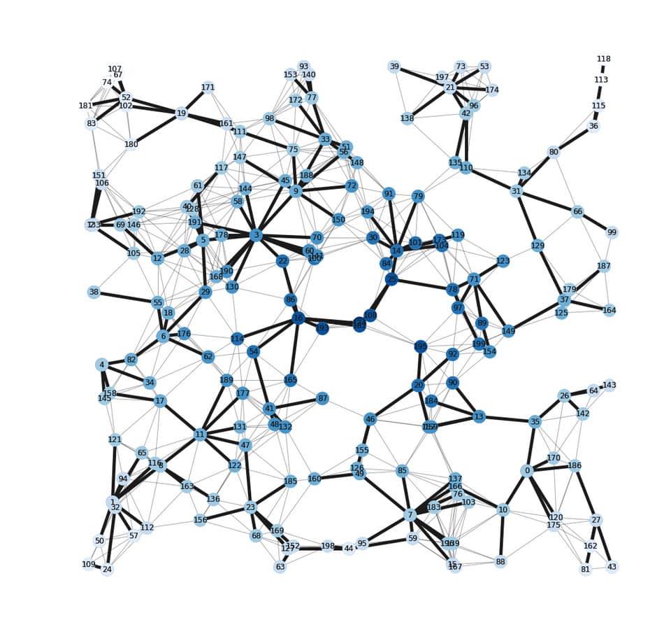

## Quantum Tourism
Creation of Graph-database of tourism data and implementation of Machine Learning, AI, and Quantum Computing Algorithms in complex network and graph data.

</img>

### Data Sources:
A sample experimental data includes the (1) geographical location of the tourist spots, hotels, restaurants, trekking sites, temples, hotels, museums, etc as nodes(properties) (2) travel cost from node A to node B, types of travel methods as edge (characteristics) data (3) Travellers are random migrators from node to node.

### Objective
Finding experimental cost-optimized travel/tour package for different categories of tours (religious tour, natural scenery, cultural exploration, etc)

### Instructions
1. Take an introductory course in Python (https://www.teachme.codes/python-docs/)
2. Learn more about graphs and networks from this online book (http://networksciencebook.com/)
3. Learn to implement network and graph data and algorithms in python package -NetworkX (https://networkx.org/)
4. Take an introduction course in graph data with Neo4J (https://neo4j.com/graphacademy/)
5. Learn more about Data Science Library in Graph Data Science (https://neo4j.com/product/graph-data-science-library/)
6. Learn More about Quantum Computing and Quantum Algorithms (https://qiskit.org/textbook/preface.html)
